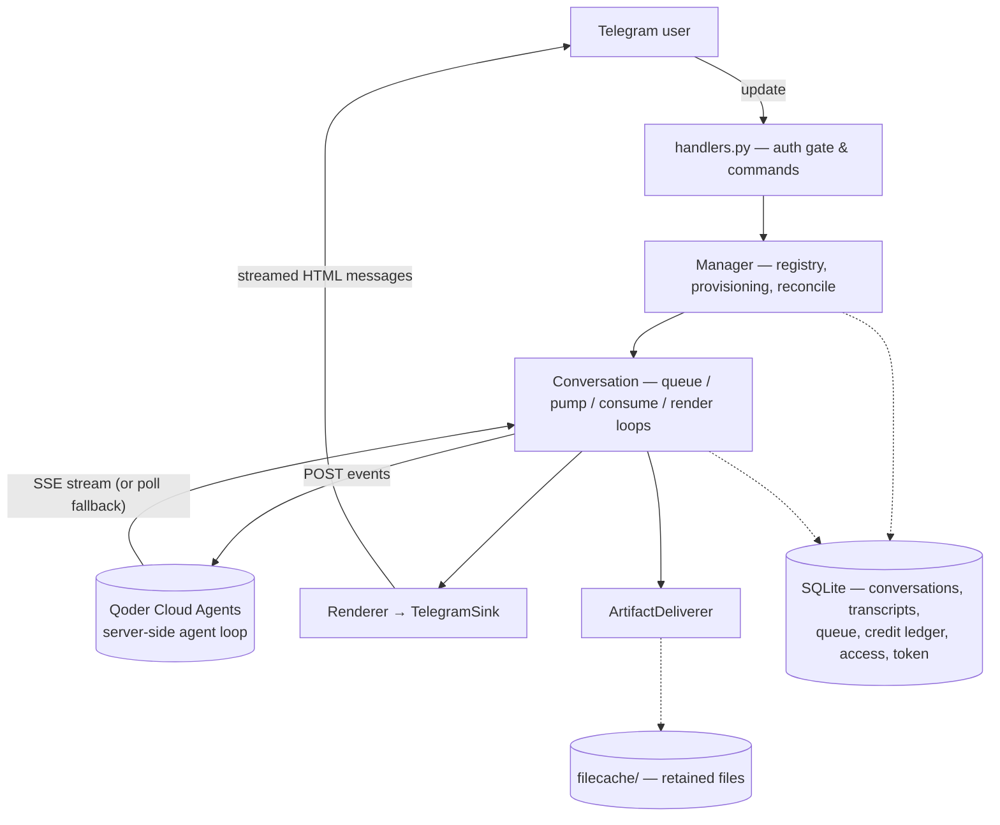

# tgagent

A **Telegram remote control for Qoder Cloud Agents**. Drive a full AI agent — writing code,
researching the web, building PowerPoint decks, generating images, reading files you send —
entirely from a Telegram chat, with the bot itself running on an Android phone under Termux.

You message a bot. Behind it, a sandboxed agent with Bash, file tools, web access and image
generation does the work and streams the result back into the chat. Conversations persist, files
cross both ways, and if the cloud session is ever lost the bot rebuilds it from the transcript it
keeps on its own device.

---

## Features

- **A real agent, not a chatbot** — code, multi-file work, web research, `.pptx`/`.pdf`/image
  generation, delivered back to you as files.
- **Runs on a phone** — the backend needs only HTTPS + SSE, so it lives on an Android device
  under Termux and keeps working while the screen is off.
- **Live streaming** — answers type into the Telegram message as they are produced, with a
  collapsible tool-activity view.
- **Two-way files** — send a document or photo and the agent reads it (images included, via real
  vision); files it produces come back to the chat.
- **Multiple conversations** — per user, per group, and per forum topic; switch between them with
  inline buttons.
- **Per-user model & cost control** — pick the model and reasoning effort, with a credit budget
  and spend ledger per user.
- **Crash- and rotation-resilient** — survives Android killing the process, and rebuilds a
  conversation from its on-device transcript when its cloud session disappears.
- **Administer it from Telegram** — manage the allowlist and rotate the API token live, no restart.

---

## How it works

**Why Cloud Agents rather than the Agent SDK:** the SDK spawns a local `qodercli` that executes
tools on the host filesystem. That binary is glibc-linked and will not run on Termux
(Android/bionic), and an SDK process dies the moment the phone dozes. Cloud Agents runs the agent
loop server-side, so the phone only needs HTTPS + SSE, sessions keep running while the screen is
off, and reconnecting replays missed events.



Each Qoder account holds five kinds of remote resource. Only a **session** runs anything or holds
files; the rest are definitions the bot provisions once and caches locally:

| resource | how many | what it is |
|---|---|---|
| environment | 1, shared | A container *template* (packages, setup script). Not an isolation boundary. |
| agent | 1 per user | Model, system prompt and tool permissions. A session inherits all three. |
| memory store | 1 per user | Long-term notes, mounted read/write into the sandbox. |
| session | 1 per conversation | The actual sandbox — where Bash runs and files live. |
| file | per upload / artifact | Account-global object storage. |

> The exact per-command cost, the resource lifecycle and the deletion policy are in
> **[docs/INTERNALS.md](docs/INTERNALS.md)**.

---

## Quickstart

Requires **Python 3.10+**.

```bash
git clone <your-fork-or-repo-url> tgagent && cd tgagent
python3 -m venv .venv
.venv/bin/pip install -e .

cp .env.example .env       # then edit .env
chmod 600 .env
.venv/bin/python -m tgagent
```

Fill in three values in `.env` to start: `QODER_PAT`, `TG_BOT_TOKEN`, and `TG_ADMIN_ID` (your own
Telegram user id — see below). Every other variable has a working default.

**Finding your Telegram user id.** Leave `TG_ADMIN_ID` and `TG_ALLOWED_IDS` empty and start the
bot. In this "discovery mode" it admits nobody, but replies to anyone who messages it with that
person's numeric id (at most once a minute). Put your id in `TG_ADMIN_ID`, restart, and you are the
administrator. `/start` re-shows your id at any time.

**On Termux (Android):** run `deploy/termux_setup.sh`, then start the bot under `tmux` with a
`termux-wakelock` so Android does not freeze it. `deploy/run.sh` and the `Termux:Boot` script share
`logs/tgagent.pid` and refuse to launch a second instance — two pollers on one token fight over the
same update queue and both lose messages. A stale pid file is cleared automatically.

There is no separate smoke test: the bot provisions its own environment on first start, and each
user's agent and memory store on their first conversation. `/health` reports what is connected.

---

## Configuration

All configuration is environment variables, read from `.env` and then overridden by any real
environment variable (so Termux can override without editing the file). `.env.example` documents
every one; a key left blank after its `=` is treated as unset, not as an empty value.

| variable | default | meaning |
|---|---|---|
| `QODER_PAT` | — *(required)* | Bootstrap Qoder Personal Access Token. Bills real credits. Overridden at runtime once you `/setpat`. |
| `TG_BOT_TOKEN` | — *(required)* | Bot token from @BotFather. Anyone holding it can impersonate the bot. |
| `TG_ADMIN_ID` | *(none)* | The single administrator's Telegram user id. Root of trust; fixed at deploy. |
| `TG_ALLOWED_IDS` | *(empty)* | Seed allowlist of user ids. The database copy takes over after the first `/allow` or `/disallow`. |
| `QODER_API_BASE` | `https://api.qoder.com` | API origin. |
| `TGAGENT_MODEL` | `qmodel_38max` | Model seeded into each new user. `/model` lists what the account offers. |
| `TGAGENT_EFFORT` | *(model default)* | Reasoning effort seeded into new users: `none`/`low`/`medium`/`high`/`xhigh`/`max`. |
| `MAX_LIVE_STREAMS` | `4` | Concurrent live SSE connections; beyond this, conversations poll instead. |
| `CREDIT_BUDGET` | `1000` | Per-user monthly credit budget. Warns at 80%, never blocks. `0` = no cap. |
| `BURST_DEBOUNCE_S` | `6.0` | Quiet period after your last message before a turn is dispatched. `0` = send each line separately. |
| `TGAGENT_LOG` | `INFO` | `DEBUG`/`INFO`/`WARNING`/`ERROR`. |
| `TGAGENT_DB` | `<project>/tgagent.db` | SQLite path — must not live in scratch space. |
| `TGAGENT_FILECACHE` | `<project>/filecache` | Retained file copies, used to re-upload attachments on resume. |

---

## Commands

### For everyone

| command | what it does |
|---|---|
| `/start` | Your user id (at most once an hour) plus help text |
| `/help` | Commands and capabilities |
| `/new` | Start a fresh conversation |
| `/sessions` (or `/switch`) | Switch between your conversations, or restore a lost one |
| `/stop` | Cancel the turn in progress |
| `/model` | List models; `/model <id>` to switch (takes effect from your next `/new`) |
| `/effort` | Reasoning effort; `/effort low` costs far less than `max` |
| `/tools` | Show or hide the tool-activity message |
| `/files` | Files sent and produced in this conversation |
| `/usage` | Your credit spend |
| `/archive` | Close this conversation |
| `/health` | Is everything connected? Shows the loaded token's fingerprint |

Just send a message (optionally with a document or photo) and the agent goes to work.

### For the administrator

These are gated on `TG_ADMIN_ID` and are deliberately not shown in the public command menu. Send
`/admin` in the chat to list them.

| command | what it does |
|---|---|
| `/admin` | List the administrator commands |
| `/allow <id>` | Permit a user id — takes effect immediately, no restart |
| `/disallow <id>` | Revoke a user id |
| `/allowed` (or `/allowlist`) | Show the admin id and the current allowlist |
| `/setpat <token>` | Validate and hot-swap the Qoder API token |

---

## Access & administration

Access has two layers:

- **The administrator** (`TG_ADMIN_ID`) — exactly one user, fixed at deploy time and **not**
  changeable at runtime, because it is the root of trust: whoever holds it can change the
  allowlist and rotate the API token. Telegram's Bot API offers no way to discover who owns a bot,
  so you name your own id. The admin is always allowed, whether or not they are on the allowlist.
- **The allowlist** — everyone else permitted to use the bot. Seeded from `TG_ALLOWED_IDS`, then
  managed live from Telegram with `/allow` and `/disallow`.

A stranger who messages the bot is refused and told their own user id (so they can pass it to you),
at most once a minute — the throttle stops anyone who finds the bot from making it burn its
Telegram send budget.

**Changes persist.** Once you use `/allow` or `/disallow`, the allowlist is stored in the bot's
database and that copy overrides the `TG_ALLOWED_IDS` seed on later boots — so a removal survives a
restart instead of being silently re-added from `.env`.

### Rotating the API token live (`/setpat`)

`/setpat <token>` swaps the Qoder credential **without a restart**:

1. The token is **validated first** against the API; a bad token changes nothing.
2. The backend is rebuilt on the new token — API client, manager, environment provisioning — and
   the bot reconciles.
3. Every session the *old* token created now returns `404`, so those conversations are marked
   *lost* and rebuild themselves from the on-device transcript on your next message (see
   [Session loss & recovery](#session-loss--recovery)).
4. The new token is stored in the database and overrides `QODER_PAT` on the next boot, so you never
   have to edit `.env` to rotate.

> **Security note.** The token arrives as plaintext in a Telegram message. The bot **never logs or
> echoes it** — it shows only a non-reversible fingerprint (the same one `/health` displays) — and
> it deletes your `/setpat` message best-effort. A bot cannot always delete a message (never in a
> DM), so prefer running `/setpat` in a DM and treat the chat history accordingly.

---

## Groups and topics

The bot works in DMs, basic groups and supergroups, with or without Topics enabled. Conversations
are keyed on **`(user, chat, topic)`** — all three — so each allowlisted member gets their own
conversation in a shared group, and in a forum supergroup each member gets one *per topic*. The
first message in a topic creates its conversation; nothing needs setting up in advance.

- **Promote the bot to admin in any group.** Telegram's privacy mode is on by default and then
  delivers only `/commands`, replies to the bot, and service messages — an ordinary "build me a
  deck" never arrives. Admins always receive everything. (Disabling privacy mode via @BotFather is
  the equivalent alternative.) Privacy mode does not apply to DMs.
- **Topics isolate sessions, not visibility.** Every member of a group can read every topic in it.
  For a conversation nobody else can see, use a DM or a group with nobody invited.
- **Replies in a non-forum group are not topics.** The bot reads the topic only from real forum
  topics, so replying to a message does not fragment your conversation.
- **Group → supergroup upgrades are followed automatically.** The upgrade changes the chat id; the
  bot moves the conversations and their history across, so nothing is orphaned.

---

## Session loss & recovery

A conversation's cloud session can become unreachable — most often because the API token was
rotated, or a sandbox was reclaimed after 24 hours of inactivity. When that happens the bot retires
the conversation as **lost** (not deleted) and rebuilds it from the transcript it keeps on its own
device, on a fresh session, carrying over anything still queued and re-uploading any files whose
copies are still in `filecache/`. You will see a notice saying so; nothing you were told is lost and
you do not have to retype anything.

Automatic rebuilds are capped at a few consecutive failures per chat, so a genuinely broken session
cannot mint a paid one every few seconds — and the transcript stays on disk either way, with
⟳ **RESTORE** offered in `/sessions`. `/health` shows how many conversations are awaiting restore.

> The full mechanics — what triggers a rebuild, what survives, and the orphan/deletion policy — are
> in **[docs/INTERNALS.md](docs/INTERNALS.md)**.

---

## Project layout

```
tgagent/            the bot; entrypoint tgagent/__main__.py (run as `python -m tgagent`)
  config.py         environment loading and every tunable constant
  auth.py           AccessControl (admin + runtime allowlist) and ownership-checked queries
  handlers.py       Telegram update handlers and commands
  runtime.py        backend lifecycle: build at boot, hot-swap the PAT live
  manager.py        conversation registry, provisioning, crash reconciliation
  convo.py          one live conversation: queue, pump, SSE consume and render loops
  qclient.py        async HTTP client for the Qoder API (retries, SSE, signed downloads)
  qsessions.py      Qoder resource operations: models, environments, agents, sessions, events
  qstream.py        SSE consumer with reconnect, dedupe and a durable cursor
  renderer.py       turns agent events into streamed, edited Telegram messages
  db.py             SQLite persistence and migrations
  budget.py         credit ledger and budget checks
  history.py        on-device transcript and resume context
  artifacts.py      artifact download and delivery
  uploads.py        inbound attachment ingestion
  qmemory.py        per-user memory store provisioning
  tgsink.py         single writer to Telegram
  tg_html.py        markdown → Telegram HTML, fence-balanced splitting
deploy/             Termux setup, run script, Termux:Boot script
docs/               internals & API reference
tgagent.db          created at runtime: conversations, transcripts, queue, credits, access, token
filecache/          created at runtime: retained file copies for cross-account resume
```

Both runtime directories are gitignored. The database is what lets the bot reconcile after Android
kills it and what stores the runtime allowlist and token; the file cache is what lets a conversation
re-upload its attachments to a *different* Qoder account after a rotation. Neither belongs in
scratch space, and neither belongs in version control.

`.env` is gitignored and is read only by `tgagent/config.py`.

---

## Internals

**[docs/INTERNALS.md](docs/INTERNALS.md)** holds the deep reference: 15 sections of empirically
verified Qoder API behaviour (artifact delivery, file downloads, event and streaming shapes,
resume, credits, the live model catalog, agent updates, reasoning text, `model.effort`, context
compaction), the per-command remote cost, and the full PAT-rotation mechanics. Where it contradicts
the published API docs, trust it.

---

## License

MIT — see [LICENSE](LICENSE). Copyright (c) 2026 Dr. Ankur.
